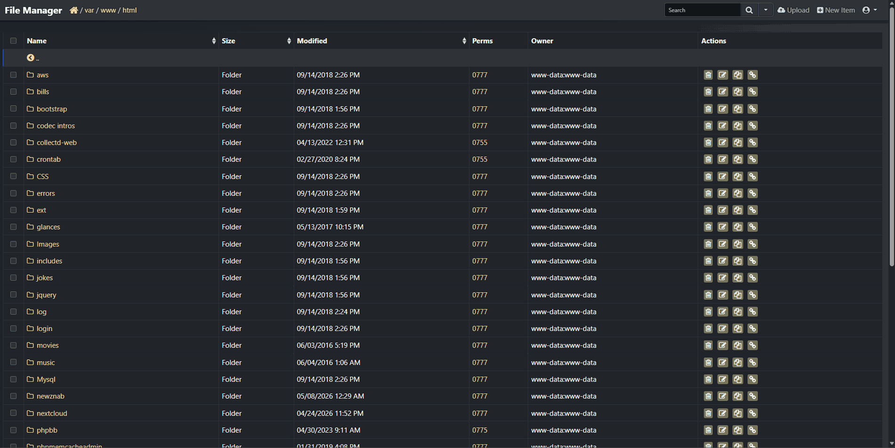

# Micro File Manager (MFM)

[](https://doonze.github.io/microfilemanager/)
[](https://github.com/doonze/microfilemanager/releases)
[](https://github.com/doonze/microfilemanager/blob/master/LICENSE)

> Micro File Manager is a fork of [TinyFileManager](https://github.com/prasathmani/tinyfilemanager) — a versatile, lightweight, single-file PHP web file manager. Drop one PHP file onto any server and instantly get a full-featured file management UI in your browser. MFM builds on TFM's solid foundation with a focus on upgrade-safe configuration, bug fixes, and usability improvements.

> **Branches & Releases:** [GitHub Releases](https://github.com/doonze/microfilemanager/releases) are stable, tested versions — grab the latest release if you just want to use MFM. The `master` branch always matches the latest release. The `dev` branch is active development towards the next version and may be unstable.

<sub>**Caution!** _Avoid utilizing this script as a standard file manager in public spaces. It is imperative to remove this script from the server after completing any tasks._</sub>

## ✨ MFM Enhancements over TinyFileManager

These are the improvements MFM adds on top of the upstream TFM codebase:

| Enhancement | Description |
|---|---|
| **Optional external config system** | All settings configurable via `config.php` — no need to touch the main file. You can still keep configs in the main file just like TFM if you prefer.<br>➕ `config.php` survives version upgrades — drop in a new `microfilemanager.php` and your settings are untouched.<br>➖ Requires copying both files when deploying — `microfilemanager.php` + `config.php`. |
| **Smart config merging** | `$auth_users`, `$readonly_users`, and `$directories_users` are merged from `config.php`, not replaced. Main file wins on conflict. |
| **Server local timezone** | File timestamps display in the server's local timezone. Removed TFM's hardcoded UTC override. Timezone is also configurable via `$default_timezone` in `config.php` if you'd prefer a specific zone over the server default. |
| **Conflict resolution** | Upload, copy, and move operations now show an **Overwrite / Rename / Cancel** dialog on name collision. TFM previously failed silently or threw an error with no recovery options. |
| **Upload conflict queue** | When uploading multiple files with simultaneous name collisions, conflicts are queued and resolved one at a time, preventing concurrent conflict dialogs from stomping each other and locking the UI. All files finish uploading before any conflict dialog appears. Each conflict modal includes a **"Do this for all remaining conflicts"** checkbox — choose Overwrite All, Cancel All, or Auto-name All (server auto-numbers: `file (1).jpg`, `file (2).jpg`, etc.) to resolve the rest in one click without seeing each file individually. |
| **Browse Files button** | Upload page now has a prominent **Browse Files** button above the drag-and-drop zone. Works around the browser security restriction that blocks programmatic file picker opens — a real button click triggers the picker immediately without any extra JS trickery. |
| **Configurable session timeout** | Session lifetime configurable via `$session_timeout` (default 4 hours). Expired sessions on AJAX requests return a `401` JSON response instead of silently failing — the page automatically reloads to the login screen. Editor save no longer falsely reports success on an expired session. |
| **Advanced Editor (ACE) config** | Advanced Editor theme and font size configurable via `config.php` (`$ace_theme`, `$ace_font_size`). TFM has these hard-coded; MFM exposes them as user-configurable settings. |
| **Dark-mode file viewer** | TFM's file viewer was hard-coded to a light-mode syntax theme regardless of UI theme. MFM's viewer auto-switches the Highlight.js theme to match the UI. Configurable separately for light and dark via `config.php`. |
| **Write-permission awareness** | TFM used `@fwrite` — errors were silently swallowed with zero feedback. MFM removes the suppressor and properly checks `is_writable()`, `fopen()`, and `fwrite()` at each step. Read-only files show a **Read Only** badge; the Save button is disabled; Ctrl+S is unbound. Save errors surface as specific messages (e.g., *"File is not writable. Check permissions/ownership."*) rather than TFM's generic "try again". HTTP 403 is returned server-side before any write is attempted. |
| **Permission denied on move** | When a move operation fails, MFM checks whether the source directory, destination directory, or destination file is the culprit and appends **(Permission denied)** to the error. TFM returned a generic move-failed message with no indication of why. |
| **Full config coverage** | Every configurable setting in the main file is documented and overridable in `config.php`. See `config.example.php`. |
| **Brute-force login protection** | Failed login attempts are tracked per IP (hashed, never stored raw). After `$login_max_attempts` (default 5) consecutive failures the IP is locked out for `$login_lockout_minutes` (default 15 minutes). Lockout expires automatically; counter clears on successful login. Both values are configurable in `config.php`. |
| **Security headers** | Sent on every response: `X-Frame-Options: SAMEORIGIN` (anti-clickjacking), `X-Content-Type-Options: nosniff` (anti-MIME-sniff), `Referrer-Policy: strict-origin-when-cross-origin`, `X-XSS-Protection: 1; mode=block`. `X-Powered-By` header is stripped to avoid leaking the PHP version. |
| **Privilege Elevation** | Optionally edit root-owned system files (e.g. `/etc/hostname`, Apache/Nginx configs) without granting `www-data` any sudo access. Requires the companion `mfm-elevate` Python daemon. See the [Privilege Elevation](#-privilege-elevation-optional) section below for details. |

## ⚡ Privilege Elevation (Optional)

MFM includes an optional privilege elevation system that lets you edit files that `www-data` cannot write — root-owned system configs, service files, and similar — without granting `www-data` any `sudo` access and without switching to a different tool.

It works via a small companion Python daemon (`mfm-elevate`) that runs as root, listens on a Unix socket, and handles authenticated write requests. MFM's PHP communicates with it entirely server-side — credentials never leave the server and never touch the browser's storage.

If the daemon is not running, MFM behaves exactly as before. There is no UI change, no error, and no configuration required on the PHP side.

### How it works

1. On every editor page load MFM silently pings the daemon socket. If it doesn't respond, nothing changes.
2. If the daemon is running and the file is not writable by `www-data`, an **⚡ Elevate** button appears next to the disabled Save button.
3. Click Elevate → enter your Linux username and password in the modal.
4. Click **Verify Access** — the daemon checks your credentials via PAM and confirms you either:
   - **Own the file** with the owner-write bit set — you can write that specific file
   - **Are a member of the `sudo` group** — you can write any non-blocked file on the system
5. If approved, the editor unlocks. The Save button becomes **Save (Elevated)**.
6. Every save re-authenticates with the daemon — no cached credentials, no session tokens.

### Requirements

- **Python 3** — already installed on most Linux servers.
- **python3-pam** — PAM bindings for Python:
  ```bash
  sudo apt install python3-pam
  ```

### Setup

See [`elevate/INSTALL.md`](elevate/INSTALL.md) for full instructions. Quick version:

```bash
# Copy daemon to server
sudo mkdir -p /opt/mfm-elevate
sudo cp elevate/mfm-elevate.py /opt/mfm-elevate/
sudo chmod 750 /opt/mfm-elevate/mfm-elevate.py
sudo chown root:root /opt/mfm-elevate/mfm-elevate.py

# Create log file
sudo touch /var/log/mfm-elevate.log
sudo chmod 640 /var/log/mfm-elevate.log

# Install and start systemd service
sudo cp elevate/mfm-elevate.service /etc/systemd/system/
sudo systemctl daemon-reload
sudo systemctl enable --now mfm-elevate
```

### Security model

- **`root` is always blocked** as a username — no exceptions.
- **Sensitive paths are blocked** at both the PHP and daemon level: `/etc/sudoers`, `/etc/sudoers.d`, `/etc/shadow`, `/etc/gshadow`, `/etc/passwd`, `/etc/group`, `/etc/ssh`, `/root`, `/proc`, `/sys`.
- **Credentials in memory only** — never written to `localStorage`, cookies, or the log. Cleared on page navigation.
- **Every write re-authenticates** — the check result is never trusted in isolation.
- **Atomic writes** — daemon uses temp file + rename to prevent partial writes on failure.
- **Socket access controlled** — socket is `root:www-data 0660`; only the web server process can connect.

---

## Demo

[](screenshot.gif)

## Requirements

- PHP 5.5.0 or higher.
- Fileinfo, iconv, zip, tar and mbstring extensions are strongly recommended.
- **Optional (Privilege Elevation only):** Python 3.6 or later and the `python3-pam` module:
  ```bash
  sudo apt install python3-pam
  ```

## How to use

Copy `microfilemanager.php` to your webspace — that's all :)

You can rename the file to anything you want (`files.php`, `index.php`, etc.).

### Configuration

**Option 1 — Edit the main file directly (simplest)**

Open `microfilemanager.php` and set your users and preferences at the top of the file, just like TFM. One file, done.

**Option 2 — Use an external `config.php` (optional, upgrade-safe)**

Copy `config.example.php` to `config.php` in the same directory. Settings there are merged in at runtime and survive upgrades — when a new version of MFM drops, just replace `microfilemanager.php` and your config is untouched.

This also lets you keep a base set of defaults in the main file and layer server-specific settings on top via `config.php`. Useful if you copy MFM to multiple servers — each gets its own users and paths in a local `config.php` without needing separate copies of the main file.

```bash
cp config.example.php config.php
```

Whichever approach you use, set your users like this:

```php
$auth_users = array(
    'admin' => '$2y$10$...', // generate hash below
);
```

:warning: **Never commit `config.php` to a public repository** — it contains your credentials.

To generate a password hash:
```bash
php -r "echo password_hash('yourpassword', PASSWORD_DEFAULT);"
```

Or use the online tool: [https://doonze.github.io/microfilemanager/pwd.html](https://doonze.github.io/microfilemanager/pwd.html)

To enable/disable authentication set `$use_auth` to true or false.

### :loudspeaker: Features

- :cd: **Open Source:** Lightweight, minimalist, and extremely simple to set up.
- :iphone: **Mobile Friendly:** Optimized for touch devices and mobile viewing.
- :information_source: **Core Features:** Easily create, delete, modify, view, download, copy, and move files.
- :arrow_double_up: **Advanced Upload Options:** Ajax-powered uploads with drag-and-drop support, URL imports, and multi-file uploads with extension filtering.
- :file_folder: **Folder & File Management:** Create and organize folders and files effortlessly.
- :gift: **Compression Tools:** Compress and extract files in `zip` and `tar` formats.
- :sunglasses: **User Permissions:** User-specific root folder mapping and session-based access control.
- :floppy_disk: **Direct URLs:** Easily copy direct URLs for files.
- :pencil2: **Code Editor:** Includes ACE editor with syntax highlighting for 150+ languages and 35+ themes.
- :page_facing_up: **Document Preview:** Google/Microsoft document viewer for PDF/DOC/XLS/PPT, supporting previews up to 25 MB.
- :zap: **Security Features:** Backup capabilities, IP blacklisting, and whitelisting.
- :mag_right: **Search Functionality:** Use `datatable.js` for fast file search and filtering.
- :file_folder: **Customizable Listings:** Exclude specific folders and files from directory views.
- :globe_with_meridians: **Multi-language Support:** Translations available in 35+ languages with `translation.json`.
- :wrench: **External Config:** All settings manageable via `config.php` without touching the main file.
- :bangbang: **And Much More!**

## License, Credit

- Available under the [GNU license](https://github.com/doonze/microfilemanager/blob/master/LICENSE)
- Forked from [TinyFileManager](https://github.com/prasathmani/tinyfilemanager) by prasathmani — original concept and development
- Original concept by github.com/alexantr/filemanager
- CDN Used — _jQuery, Bootstrap, Font Awesome, Highlight js, ace js, DropZone js, and DataTable js_
- To report a bug or request a feature, please file an [issue](https://github.com/doonze/microfilemanager/issues)
